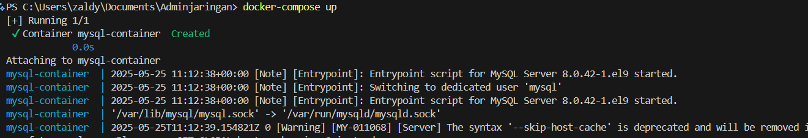
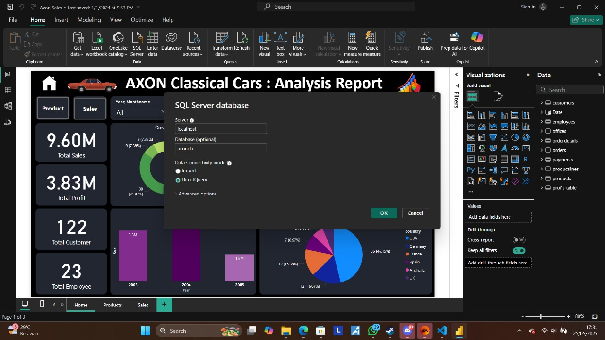
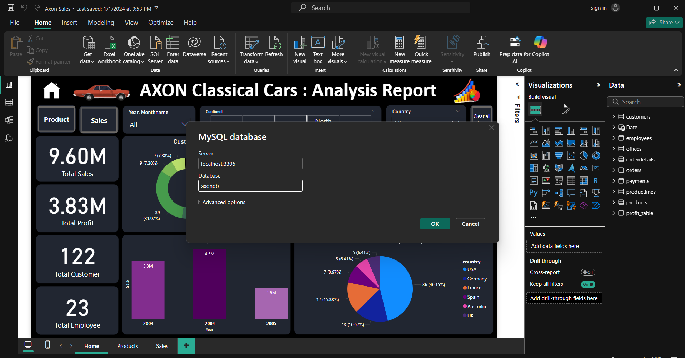
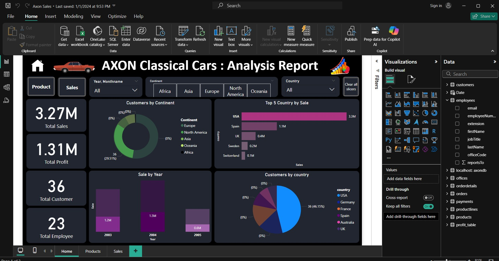

<p align="center">
  
</p>

<h1 align="center">Admin Jaringan 2025</h1>

```
Dosen Pengampu: Dr Ferry Astika Saputra ST, M.Sc
Nama: Mohammad Rizaldy Ramadhan
NRP: 3123600011
Kelas: D4 IT A
```

# Membuat Container System Sederhana

## 1. Instalasi Prasyarat

Unduh dan instal semua file prasyarat dari link berikut:  
https://drive.google.com/drive/folders/10THmB2YZAILg9gXHg42UkIYqd6AKsiRc?usp=sharing

Pastikan kamu sudah menginstal:
- **Docker Desktop** (untuk menjalankan container MySQL)
- **Power BI Desktop**
- **MySQL Connector/ODBC** (driver untuk koneksi Power BI ke MySQL)

---

## 2. Ekstrak dan Masuk ke Folder

Ekstrak file yang sudah diunduh, lalu masuk ke folder hasil ekstraksi.  
Struktur folder seharusnya seperti berikut:

```
Directory: C:\Users\zaldy\Documents\Adminjaringan
Mode                 LastWriteTime         Length Name
----                 -------------         ------ ----
------          1/1/2024   9:53 PM         735990 Axon Sales.pbix
------          1/1/2024   9:53 PM          11658 Axon SQL.sql
-a----          1/1/2024   9:53 PM         210202 Axon.sql
------          4/5/2024   1:08 PM        5205559 Axon_Sales_Analysis_SQL.pptx
-a----         5/25/2025   5:28 PM            423 docker-compose.yaml
-a----         5/25/2025   5:19 PM        6001985 drive-download-20250525T101941Z-1-001.zip
------          1/1/2024   9:53 PM           2854 README.md
```

---

## 3. Buat File `docker-compose.yaml`

Buat file baru bernama `docker-compose.yaml` dengan isi sebagai berikut:

```yaml
version: '3.8'

services:
  db:
    image: mysql:8.0
    container_name: mysql-container
    restart: unless-stopped
    environment:
      MYSQL_ROOT_PASSWORD: secret123
      MYSQL_DATABASE: axondb
      MYSQL_USER: axonuser
      MYSQL_PASSWORD: axonsecret
    volumes:
      - mysql-data:/var/lib/mysql
      - ./Axon.sql:/docker-entrypoint-initdb.d/Axon.sql:ro
    ports:
      - "3306:3306"

volumes:
  mysql-data:
```

---

## 4. Jalankan Docker Container

Buka Command Prompt di folder tersebut, lalu jalankan perintah berikut:

```sh
docker-compose up -d
```

Tunggu beberapa saat hingga container MySQL berjalan dan database terinisialisasi.

<p align="center">
  
</p>

---

## 5. Buka File Power BI

Buka file **Axon Sales.pbix** menggunakan **Power BI Desktop**.

<p align="center">
  
</p>

---

## 6. Koneksi ke Database MySQL

Saat diminta koneksi ke database, gunakan data berikut:

- **Server:** `localhost`
- **Database:** `axondb`
- **Username:** `axonuser`
- **Password:** `axonsecret`

Jika muncul permintaan instalasi driver, pastikan **MySQL Connector/ODBC** sudah terinstal di komputer kamu.

<p align="center">
  
</p>

---

## 7. Hasil

Jika berhasil, data dari database MySQL akan muncul di Power BI dan bisa langsung digunakan untuk analisis.

<p align="center">
  
</p>

---

**Selamat mencoba! Jika ada kendala, silakan hubungi admin atau cek README ini kembali.**
