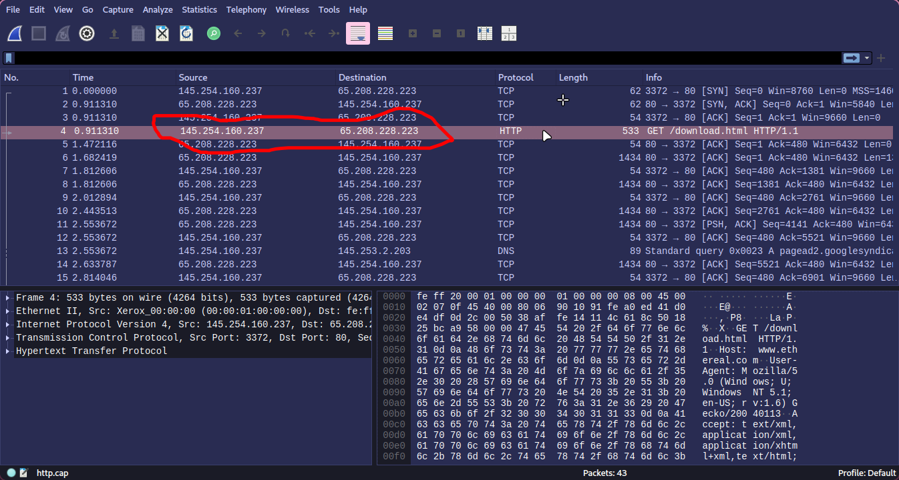
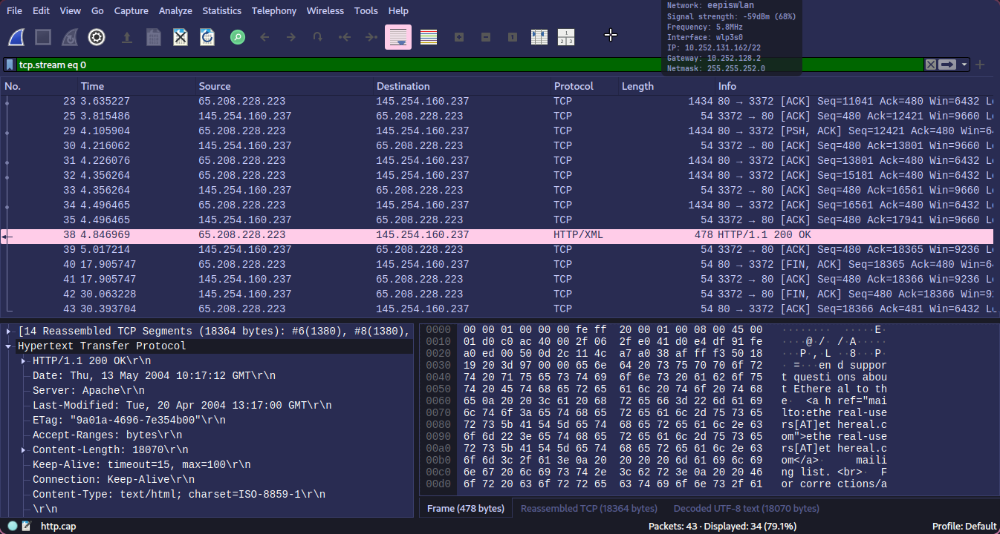
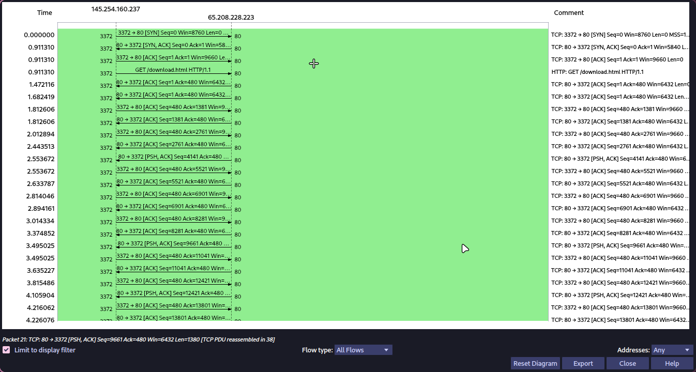
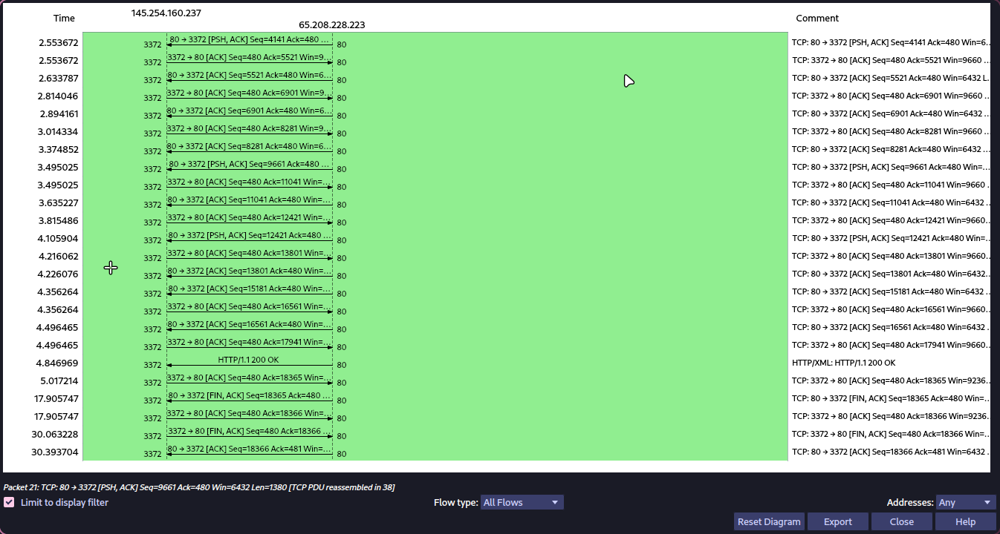

  

<h1 align="center">Admin Jaringan 2025</h1>

# Tugas 1 - **REVIEW**

<!--toc:start-->
- [Workshop Administrasi Jaringan Tugas 1 - **REVIEW**](#workshop-administrasi-jaringan-tugas-1-review)
  - [Tugas 1: Analisa file http.cap](#tugas-1-analisa-file-httpcap)
    - [1. Download file sampel `http.cap`](#1-download-file-sampel-httpcap)
    - [2. Explorasi dan Analisis dari `http.cap` menggunakan Wireshark](#2-explorasi-dan-analisis-dari-httpcap-menggunakan-wireshark)
  - [Tugas 2: Analisis Gambar Types of Data Deliveries](#tugas-2-analisis-gambar-types-of-data-deliveries)
    - [1. Node to Node (Data Link Layer)](#1-node-to-node-data-link-layer)
    - [2. Host to Host (Network Layer)](#2-host-to-host-network-layer)
    - [3. Process to Process (Transport Layer)](#3-process-to-process-transport-layer)
  - [Tugas 3: Resume Tahapan TCP](#tugas-3-resume-tahapan-tcp)
<!--toc:end-->

## Tugas 1: Analisa file http.cap

### 1. Download file sampel `http.cap` [link](https://wiki.wireshark.org/uploads/27707187aeb30df68e70c8fb9d614981/http.cap)
### 2. Explorasi dan Analisis dari `http.cap` menggunakan wireshark 
- IP Server dan Client
  - IP Server: `65.208.228.223`
  - IP Client: `145.254.160.237`
  
- Versi HTTP
  - Menggunakan HTTP versi `1.1` (HTTP/1.1)
  
- Waktu Client mengirim request
  `0.911310 s`
  
- Waktu server menerima HTTP request dari client  
  `1.472 s` 
  
- waktu yang dibutuhkan untuk transfer dan response dari client ke server
  `3.935659 s` 
  

## Tugas 2: Analisis Gambar Types of Data Deliveries
Gambar ini menjelaskan **tipe-tipe data delivery** dalam jaringan komputer berdasarkan **lapisan model OSI**. Berikut adalah penjelasannya:

### **1. Node to Node (Data Link Layer)**
   - Merupakan komunikasi antara dua perangkat jaringan yang terhubung langsung, seperti antara komputer dan router atau antara dua router yang berdekatan.
   - Data dikirim dalam bentuk **frame** melalui **media fisik** seperti kabel atau Wi-Fi.
   - Contoh: Ethernet, Wi-Fi, dan komunikasi antar switch.

### **2. Host to Host (Network Layer)**
   - Merupakan komunikasi antara dua perangkat di jaringan yang berbeda (misalnya, komputer pengguna dengan server di internet).
   - Data dikirim dalam bentuk **packet**, dan prosesnya melibatkan routing serta pengalamatan IP.
   - Contoh: Pengiriman data dari komputer di rumah ke server Google melalui beberapa router.

### **3. Process to Process (Transport Layer)**
   - Merupakan komunikasi antar **proses** dalam perangkat yang berbeda.
   - Menggunakan **port number** untuk memastikan bahwa data sampai ke aplikasi yang benar.
   - Contoh: Proses browser mengakses server web melalui protokol HTTP (port 80 atau 443).

## Tugas 3: Resume Tahapan TCP

1. **Three-Way Handshake** (Membangun Koneksi)  
   - **SYN**: Klien mengirim paket SYN (synchronize) ke server untuk memulai koneksi.  
   - **SYN-ACK**: Server merespons dengan SYN-ACK (synchronize-acknowledge) untuk menyetujui koneksi.  
   - **ACK**: Klien mengirim paket ACK (acknowledge), menandakan koneksi telah terbentuk.  

2. **Data Transmission** (Pengiriman Data)  
   - Data dikirim dalam bentuk segmen TCP yang diberi nomor urut (sequence number).  
   - Penerima mengirim ACK untuk setiap segmen yang diterima dengan sukses.  
   - Jika ada segmen yang hilang atau rusak, pengirim akan mengirim ulang (retransmission).  

3. **Four-Way Handshake** (Terminasi Koneksi)  
   - **FIN**: Salah satu pihak mengirim paket FIN (finish) untuk mengakhiri koneksi.  
   - **ACK**: Pihak penerima mengonfirmasi dengan paket ACK.  
   - **FIN**: Penerima juga mengirim FIN untuk menutup koneksi dari sisinya.  
   - **ACK**: Pengirim mengirim paket ACK terakhir, menandakan koneksi ditutup sepenuhnya.  
