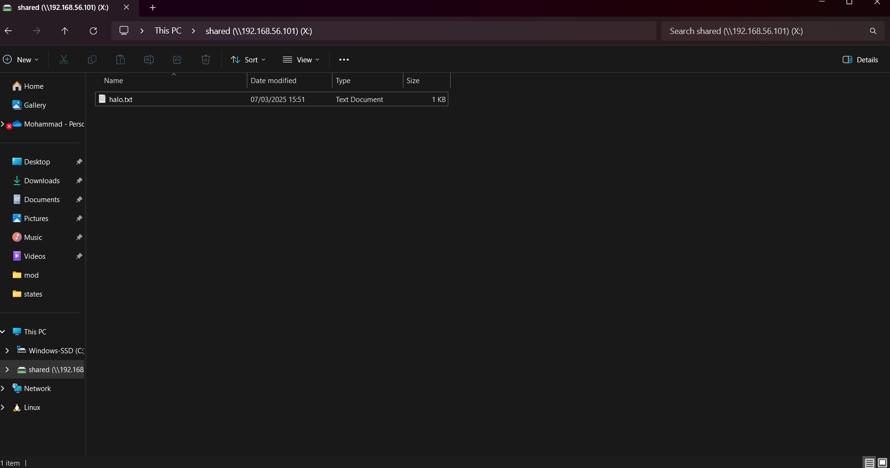
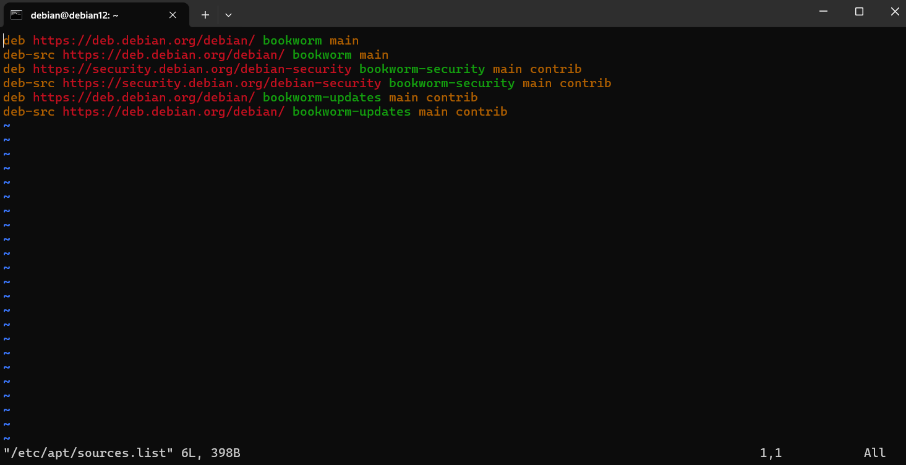

<p align="center">
  
</p>
<link rel="stylesheet" href="github-markdown.css">
<h1 align="center">Admin Jaringan 2025</h1>

```
Dosen Pengampu: Dr Ferry Astika Saputra ST, M.Sc
Nama: Mohammad Rizaldy Ramadhan
NRP: 3123600011
Kelas: D4 IT A
```
- [A. Instalasi NTP Client](#a-instalasi-ntp-client)
- [B. Instalasi dan konfigurasi Samba](#b-instalasi-dan-konfigurasi-samba)
  - [1. Membuat public shared folder](#1-membuat-public-shared-folder)
  - [2. Membuat limited shared folder](#2-membuat-limited-shared-folder)
  - [3. akses ke folder Share dari CLI client](#3-akses-ke-folder-share-dari-cli-client)
- [C. Rangkuman tentang package management](#c-rangkuman-tentang-package-management)
  - [Pendahuluan](#pendahuluan)
  - [File `sources.list`](#file-sourceslist)
    - [A. Cara user mencari dan menampilkan informasi](#a-cara-user-mencari-dan-menampilkan-informasi)
    - [B. Cara superuser mencari dan menampilkan informassi](#b-cara-superuser-mencari-dan-menampilkan-informassi)


## A. Instalasi NTP Client 
1. install ntpsec
    ```bash
    $ sudo apt install ntpsec
    ```
2. lakukan konfigurasi ntp di `/etc/ntpsec/ntp.conf` dengan merubah server sekarang menjadi server indonesia dari https://www.ntppool.org/en/zone/id di baris 34-37
    ```bash
    $ vim /etc/ntpsec/ntp.conf
    34 #pool 0.ubuntu.pool.ntp.org iburst
    35 #pool 1.ubuntu.pool.ntp.org iburst
    36 #pool 2.ubuntu.pool.ntp.org iburst
    37 #pool 3.ubuntu.pool.ntp.org iburst
    38 server 0.id.pool.ntp.org
    39 server 1.id.pool.ntp.org
    40 server 2.id.pool.ntp.org
    41 server 3.id.pool.ntp.org
    ```
3. Restart service ntpsec
    ```bash
    $ sudo systemctl restart ntpsec
    ```
4. Verifikasi status
    ```bash
    $ ntpq -p
        remote                                   refid      st t when poll reach   delay   offset   jitter
    =======================================================================================================
    103.169.192.230                         103.147.22.149   3 u    3   64    1  49.2101  -1.8870   0.0000
    14.102.153.110                          133.243.238.244  2 u   12   64    1  52.9380  -2.0695   0.0000
    103.177.8.230                           202.65.114.202   3 u   21   64    1  51.1884  -4.3603   0.0000
    116.12.46.30                            27.54.117.72     3 u   30   64    1  50.4119  -3.9637   0.0000
    185.125.190.58                          79.243.60.50     2 u   39   64    1 337.3182 -13.5331   0.0000
    ```

## B. Instalasi dan konfigurasi Samba 
### 1. Membuat public shared folder

1. Install dan konfigurasi samba serta buat folder yang akan di share
    ```bash
    $ sudo apt install samba
    $ sudo mkdir -p ~/shared_folder
    $ sudo chmod -R 777 ~/shared_folder
    $ sudo vim /etc/samba/smb.conf
        [shared]
            path = /home/debian/shared_folder
            comment = Publicly Shared Folder
            writable = yes
            guest ok = yes
            guest only = yes
            force create mode = 777
            force directory mode = 777
    
    $ sudo adduser debian
    $ sudo smbpasswd -a debian
    New SMB password:     # set passwords
    Retype new SMB password:
    Added user debian.
    $ sudo usermod -aG sambalimited debian

2. Check IP guest machine
   
    ```bash
    $ ip a
    1: lo: <LOOPBACK,UP,LOWER_UP> mtu 65536 qdisc noqueue state UNKNOWN group default qlen 1000
        link/loopback 00:00:00:00:00:00 brd 00:00:00:00:00:00
        inet 127.0.0.1/8 scope host lo
        valid_lft forever preferred_lft forever
        inet6 ::1/128 scope host
        valid_lft forever preferred_lft forever
    2: enp0s3: <BROADCAST,MULTICAST,UP,LOWER_UP> mtu 1500 qdisc fq_codel state UP group default qlen 1000
        link/ether 08:00:27:18:5c:83 brd ff:ff:ff:ff:ff:ff
        inet 192.168.56.101/24 brd 192.168.56.255 scope global dynamic enp0s3
        valid_lft 402sec preferred_lft 402sec
        inet6 fe80::a00:27ff:fe18:5c83/64 scope link
        valid_lft forever preferred_lft forever
    ```

### 2. Membuat limited shared folder
1. Install dan konfigurasi samba serta buat folder yang akan di share
    ```bash
    $ sudo apt install samba
    $ sudo groupadd sambalimited
    $ sudo mkdir -p ~/limited_shared_folder
    $ sudo chgrp sambalimited ~/limited_shared_folder
    $ sudo chmod -R 770 ~/limited_shared_folder
    $ sudo vim /etc/samba/smb.conf
        [limited_shared]
             path = /home/debian/limited_shared_folder
            # require authentication
            security = user
            # specify shared directory
            # allow writing
            writable = yes
            # not allow guest user (nobody)
            guest ok = no
            # allow only [smbgroup01] group
            valid users = @sambalimited
            # set group for new files/directories to [smbgroup01]
            force group = sambalimited
            # set permission [770] when file created
            force create mode = 770
            # set permission [770] when folder created
            force directory mode = 770
            # inherit permissions from parent folder
            inherit permissions = yes
            comment = Limited Shared Folder
            # add Samba user

    $ sudo adduser debian
    $ sudo smbpasswd -a debian
    New SMB password:     # set passwords
    Retype new SMB password:
    Added user debian.
    $ sudo usermod -aG sambalimited debian
    ```

2. Check IP guest machine
   
    ```bash
    $ ip a
    1: lo: <LOOPBACK,UP,LOWER_UP> mtu 65536 qdisc noqueue state UNKNOWN group default qlen 1000
        link/loopback 00:00:00:00:00:00 brd 00:00:00:00:00:00
        inet 127.0.0.1/8 scope host lo
        valid_lft forever preferred_lft forever
        inet6 ::1/128 scope host
        valid_lft forever preferred_lft forever
    2: enp0s3: <BROADCAST,MULTICAST,UP,LOWER_UP> mtu 1500 qdisc fq_codel state UP group default qlen 1000
        link/ether 08:00:27:18:5c:83 brd ff:ff:ff:ff:ff:ff
        inet 192.168.56.101/24 brd 192.168.56.255 scope global dynamic enp0s3
        valid_lft 402sec preferred_lft 402sec
        inet6 fe80::a00:27ff:fe18:5c83/64 scope link
        valid_lft forever preferred_lft forever
    ```

### 3. akses ke folder Share dari CLI client
1. Dari host machine, check apakah service samba di guest machine sudah bisa terlihat untuk Sharename `share` dan `limited_shared`
   
    ```bash
    $ smbclient -L //192.168.56.101/shared -N

        Sharename       Type      Comment
        ---------       ----      -------
        print$          Disk      Printer Drivers
        shared          Disk      halo fajar
        limited_shared  Disk      halo akbar private
        IPC$            IPC       IPC Service (Samba 4.17.12-Debian)
        nobody          Disk      Home Directories
        
2. Apabila sudah terlihat, langsung connect untuk public shared folder
    ```bash
    $ smbclient //192.168.56.101/shared -N
    Try "help" to get a list of possible commands.
    smb: \>
    ```
3. Apabila sudah terlihat, langsung connect dengan menginputkan username dan password untuk limited shared folder
    ```bash
    $ smbclient //192.168.56.101/limited_shared -U debian
    Password for [WORKGROUP\debian]:
    Try "help" to get a list of possible commands.
    smb: \> ls
    .                                   D        0  Fri Mar  7 16:05:34 2025
    ..                                  D        0  Fri Mar  7 16:06:20 2025
    foo.txt                             A       10  Fri Mar  7 16:05:34 2025

                219851752 blocks of size 1024. 208610576 blocks available
    smb: \>
4. (OPSIONAL) Koneksi dari windows
   
    
## C. Rangkuman tentang package management
### Pendahuluan
Debian GNU/Linux menggunakan metodologi 'repository' untuk distribusi aplikasi. Metodologi ini memungkinkan untuk sentralisasi software dan juga penggunakan antarmuka yang sederhana untuk mengelola sistem pengguna tanpa harus berkunjung ke website pemilik software yang digunakan.

### File `sources.list`
alamat internet untuk repository debian disimpan di `/etc/apt/sources.list`

   untuk merubah file tersebut, bisa menggunakan 2 command berikut dengan privilege superuser.
   ```bash
   $ apt edit-sources
   # atau, langsung akses file menggunakan text editor
   $ vim /etc/apt/sources.list
   ```


- **deb**: Paket biner yang siap diinstal  
- **deb-src**: Kode sumber paket  
- **bookworm**: Nama rilis Debian (versi 12)  
- **main**: Komponen resmi Debian, hanya perangkat lunak free  
- **contrib**: Perangkat lunak free yang membutuhkan dependensi non-free  
- **bookworm-security**: Repositori pembaruan keamanan untuk Bookworm  
- **bookworm-updates**: Pembaruan reguler sebelum rilis resmi

2. APT di terminal
   Untuk mengelola sebuah software yang tersedia di repository dan di sistem, Debian menggunakan sebuah software dengan nama `apt` (Advanced Package Tool) yang bisa digunakan melalui terminal.

#### A. Cara user mencari dan menampilkan informasi

|Command|Description|
|-----------|---------------|
|`apt show sesuatu`| Menampilkan informasi tentang package `sesuatu`|
|`apt search sesuatu`| Mencari package `sesuatu`|
|`apt-cache policy sesuatu`| Mencari versi yang ada untuk package `sesuatu`|

#### B. Cara superuser mencari dan menampilkan informassi
| Perintah                 | Deskripsi                                                              |
|--------------------------|-----------------------------------------------------------------------|
| `apt full-upgrade`       | Memperbarui paket yang terinstal, dengan menambahkan/menghapus paket lain jika diperlukan |
| `apt remove sesuatu`     | Menghapus paket `sesuatu`, tetapi tidak menghapus file konfigurasi   |
| `apt autoremove`         | Menghapus paket yang tidak diperlukan secara otomatis               |
| `apt purge sesuatu`      | Menghapus paket `sesuatu` beserta file konfigurasinya               |
| `apt clean`              | Membersihkan cache lokal dari paket yang terinstal                  |
| `apt autoclean`          | Membersihkan cache lokal dari paket yang sudah usang                |
| `apt-mark showmanual`    | Menandai paket sebagai "diinstal secara manual"                     |
***TIPS***
> Command All-In-One untuk update informasi repo, update sistem, dan membersihkan cache:
> `apt update && apt upgrade && apt autoclean`

> Command untuk membersihkan package yang tidak digunakan:
> `apt autoremove --purge`